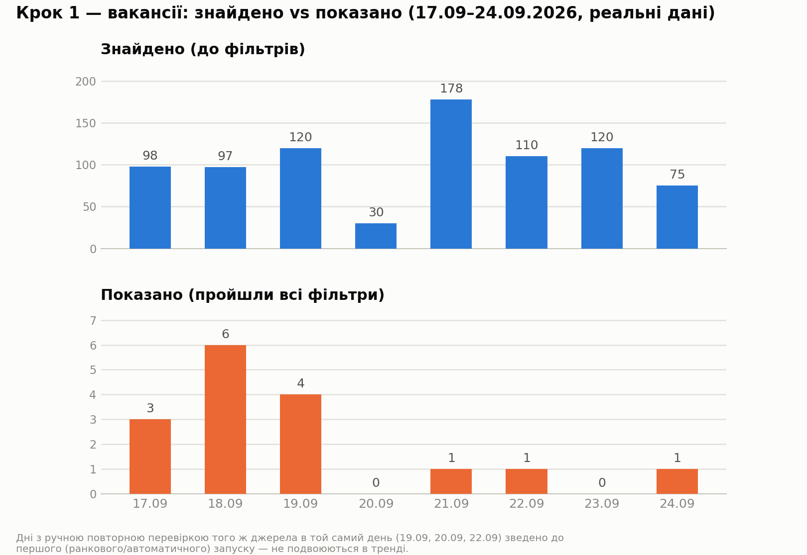
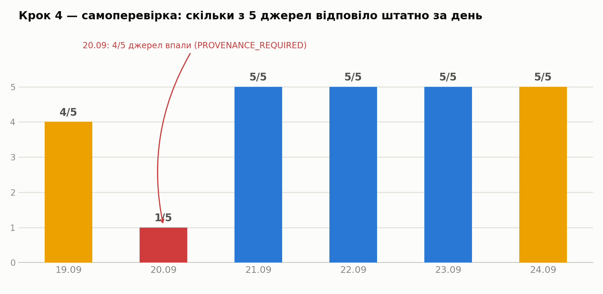

# Реальні дані щоденного запуску (17–24.09.2026)

## Що це і звідки

Це не приклад, не мокап — це реальний робочий журнал щоденної автоматизації
пошуку роботи за 8 днів поспіль, взятий напряму з трьох службових Google-таблиць
("Результат щоденної перевірки", "Метрики автопошуку вакансій", "Метрики
автопошуку фріланс-проєктів").

**Важливе уточнення щодо джерела.** Ці конкретні рядки написав "мозок" системи
у своїй поточній формі — Claude, що виконує щоденну scheduled-задачу з
доступом до вебу через інструмент типу WebFetch (та сама "текстова версія
промпту", яку описує вступ до `README.md`). `python main.py` із цього
репозиторію ще жодного разу не запускався по-справжньому: `config.py`
навмисно вказує на ТІ САМІ назви службових файлів ("Результат щоденної
перевірки" тощо), щоб typed Python-пайплайн, коли для нього буде готовий
живий доступ (Google OAuth + Claude API на машині власника), продовжив саме
цей журнал — той самий формат рядків, той самий контракт полів
(`SELFCHECK_HEADER`, `METRICS_HEADER`, `FREELANCE_METRICS_HEADER` у
`models.py`), нуль розбіжностей у схемі. 29 тестів (`tests/`, мокований
прогін кожного кроку) підтверджують, що Python-реалізація відтворює саме цю
логіку; живих рядків від самого `main.py` в цих таблицях поки немає.

Іншими словами: нижче — доказ того, що бізнес-логіка, яку цей репозиторій
типізує і покриває тестами, вже 8+ днів приймає реальні рішення на реальних
даних. Не доказ того, що вже запускався саме цей Python-код.

## Крок 1 — вакансії: знайдено vs показано

Конверсія "показано/знайдено" тримається в діапазоні 0–6% — і це очікувано,
не помилка фільтра: профіль кандидата (Junior/без досвіду, повний remote,
ЗП від порогу з `config.MIN_SALARY_UAH`, англійська до `config.MAX_ENGLISH_LEVEL`)
відсікає переважну більшість ринку за задумом. 20.09 і 23.09 — показові дні:
0 показаних не через збій, а тому що жодна з реально знайдених вакансій не
пройшла критерії (23.09: повне 5/5 покриття джерел, справжній нуль).

## Крок 4 — самоперевірка: чи можна довіряти цифрам вище

Це і є вся причина існування Кроку 4: 20.09 чотири з п'яти джерел одночасно
відповіли відмовою доступу (PROVENANCE_REQUIRED — інструмент вебдоступу не
міг підтвердити дозвіл без живого користувача в автономному запуску). Без
Кроку 4 це виглядало б як "сьогодні просто мало вакансій". З Кроком 4 —
чітко видно: це не ринок сплющився, це джерела недоступні, і тренд того дня
свідомо позначений непорівнянним із сусідніми. Наступного ранку (21.09) —
повне відновлення, 5/5.

## Крок 1.2 — фріланс: чесний нуль, а не тиша

За всі 3 дні, відколи Крок 1.2 активний (22–24.09), показано 0 релевантних
фріланс-проєктів по обох категоріях Freelancehunt і 0 по Telegram-каналу.
Це не мовчазний збій — власний сигнал системи ("дні поспіль з 0") це фіксує
явно: 3 дні поспіль для BI/SQL-категорій, 2 для Telegram-каналу, на момент
24.09. Поріг перегляду — `FREELANCE_ZERO_STREAK_REVIEW_THRESHOLD = 7` — ще
не досягнуто, тому це поки що спостереження, не сигнал "джерело зламане".
Якщо стрік дійде до 7 — це буде явний привід переглянути критерії
релевантності чи сам вибір категорій, а не тихо змиритися з порожнім
результатом.

## Кілька реальних рішень із журналу

За ці 8 днів система самостійно виключила вакансію "Data Analyst Trainee
Junior" (Ideal, robota.ua) **тричі поспіль** (21.09, 22.09, 23.09) — вона
щоразу повертається у видачу, і щоразу застосовується те саме правило,
встановлене 21.09 (підозра на MLM-подібну схему: оплата $500/тиждень +
непрозорі бонуси, вимога громадянства України, відсутність реальних
технічних вимог). Окремо виявлена й задокументована системна проблема
достовірності дат на robota.ua/work.ua — мітки на кшталт "16 годин тому" у
списку вакансій розходились із фактичною датою на сторінці самої вакансії
(в одному випадку — на 20 днів); це підтвердилось на рівні і списку, і
окремої картки, і тепер враховується як відоме джерело шуму, а не
поодинокий збій.

## Як це продовжиться в Python-версії

Коли `python main.py` запуститься вперше на машині з реальними Google OAuth
credentials і `ANTHROPIC_API_KEY` (README, розділ "Налаштування Google
API") — нові рядки лягатимуть у ТІ САМІ три таблиці, в тому самому форматі,
продовжуючи цей журнал далі. Різниця буде лише в тому, хто саме зібрав
кандидатів на вхід у Claude-оцінку: `requests` + BeautifulSoup замість
WebFetch, з детермінованим підрахунком у Python замість "лічильників по
ходу" — саме та відмінність, заради якої весь цей репозиторій існує (див.
вступ до `README.md`).
